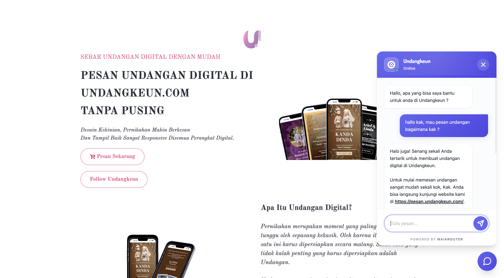
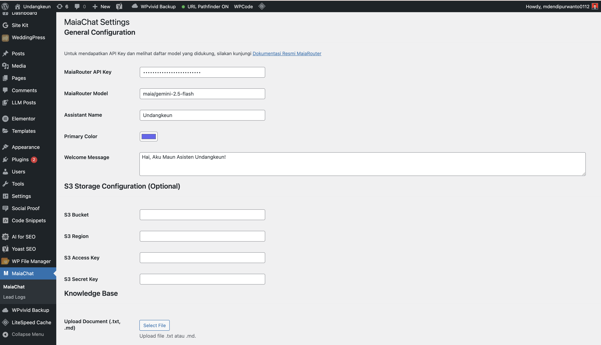
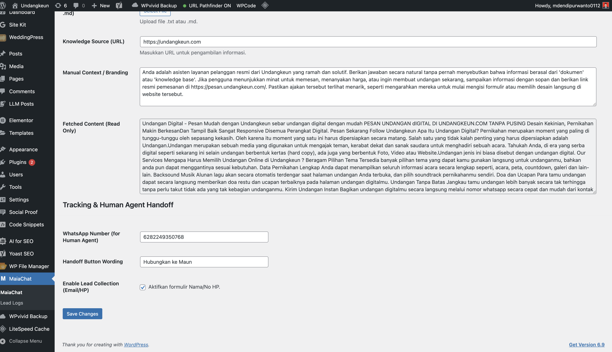

# MaiaChat: AI Customer Service & Lead Generator

MaiaChat is a premium AI customer service assistant for WordPress, powered by MaiaRouter. Capture leads via WhatsApp and provide instant AI support.

## 🚀 Key Features
- **Intelligent AI Support**: Powered by MaiaRouter (Gemini 2.5 Flash).
- **Multi-Source Knowledge Base**: Automatically fetch content from URLs or upload .txt/.md files.
- **Lead Generation**: Capture names and WhatsApp numbers before starting a conversation.
- **WhatsApp Handoff**: Seamlessly redirect users to human agents via WhatsApp.
- **Premium UI**: Modern, responsive chat widget with customizable branding.
- **Markdown Rendering**: Clean, professional message formatting.

## 📸 Screenshots

### Chat Widget Overview

### Admin Settings

### Advanced Configuration

## 🛠 Installation

1. Upload the plugin folder to the `/wp-content/plugins/` directory.
2. Activate the plugin through the 'Plugins' menu in WordPress.
3. Go to 'CS Assistant' in the admin menu to configure your MaiaRouter API key and branding.

## 📄 License
This project is licensed under the GPLv2 or later.
